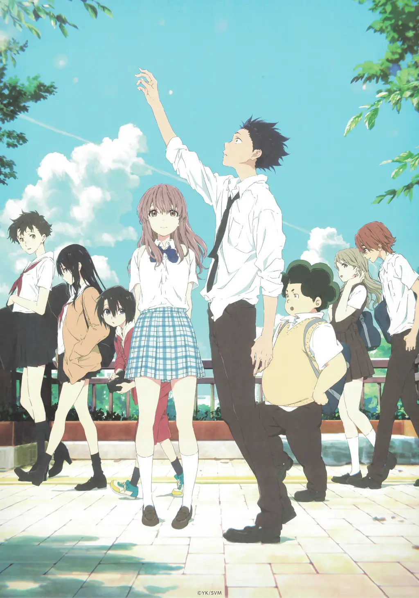
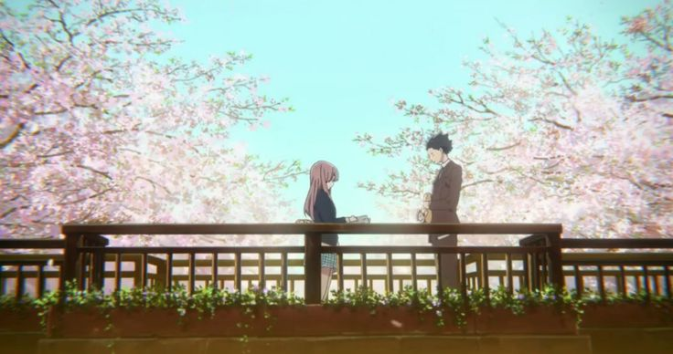
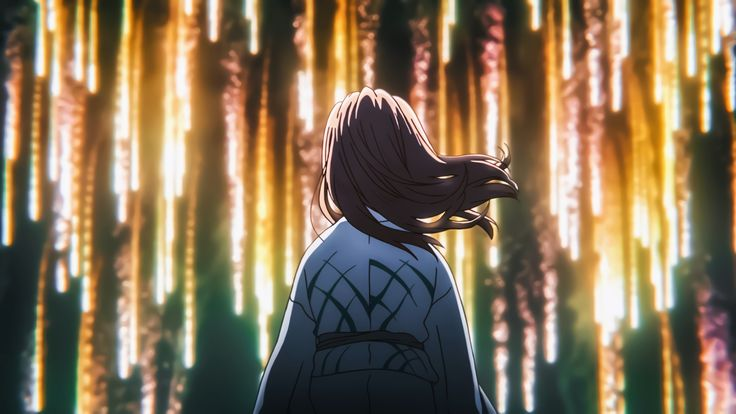

I wasn't ready for this movie. I thought I was, I'd heard it was sad, heard it was about bullying and redemption. But knowing what a movie is about and actually experiencing it are completely different things.

**A Silent Voice** (Koe no Katachi) broke me in ways I didn't expect. Not with big dramatic moments, but with quiet, honest portrayals of guilt, shame, and the desperate need to be forgiven.

*Sometimes the hardest person to face is yourself.*

## What It's About

Shoya Ishida bullied a deaf girl named Shoko Nishimiya in elementary school. Years later, isolated and suicidal, he decides to find her. To apologize? Make amends? He doesn't even know.

That's the thing about this movie, it doesn't give easy answers. Shoya wants forgiveness, but the movie asks: does he deserve it? Can you ever really make up for hurting someone? What does redemption even look like?

## Why It Hurts

The movie understands something most stories about bullying don't: everyone involved is damaged.Not just the victim. The bully carries their guilt. The bystanders carry their complicity. Everyone is broken in different ways.

Shoya's guilt is so overwhelming he can't even look people in the face. The movie shows other people's faces as X marks, representing his inability to connect. He's convinced he doesn't deserve to be happy, doesn't deserve friends, doesn't deserve to live.

And Shoko? She blames herself. For being deaf. For being a burden. For existing. She apologizes constantly, even when nothing is her fault.

> "I'm sorry for being born."

## The Weight of It

What makes this movie so heavy is how real it feels. The bullying isn't cartoonishly evil. It's casual cruelty from kids who don't understand the impact of their actions. The guilt isn't dramatic. It's quiet, persistent, suffocating.

Shoya doesn't become a better person overnight. He tries, fails, hurts people again, has to try again. Redemption isn't a moment. It's a process. Messy, painful, uncertain.

*Connection is terrifying when you've convinced yourself you don't deserve it.*

The movie also doesn't let anyone off easy. Shoya's former friends who participated in the bullying? They moved on, forgot about it, act like it never happened. But Shoya can't forget. The weight of what he did defines his entire existence.

## What It's Really About

Beneath the story about bullying and redemption, this is a movie about communication. About how hard it is to truly connect with another person. About how we hurt each other, often without meaning to. About how we hurt ourselves even more.

Shoko uses sign language, but that's not the only barrier. Everyone in this movie struggles to communicate what they really feel. Words fail. Intentions get misunderstood. People talk past each other.

So, most honest moments happen in silence.

## The Technical Side

Kyoto Animation made this, and you can feel their care in every frame:

**Visual Storytelling:**
- X marks on faces showing isolation
- Color palette shifts with emotional states
- Water imagery throughout for cleansing, drowning, rebirth
- Sign language animated with incredible detail

**Sound Design:**
The movie uses silence deliberately. Sometimes we hear from Shoko's perspective, muffled, distant sounds. It's uncomfortable. It makes you aware of how much we take hearing for granted.

**The Score:**
Kensuke Ushio's soundtrack is haunting. Piano pieces that feel fragile, like they might break. Electronic elements that create unease. Music that knows when to be present and when to step back.

*The fireworks scene. If you know, you know.*

## Why It Matters

This movie doesn't offer easy comfort. It doesn't say "forgive yourself and everything will be okay." It says forgiveness is complicated. Redemption is hard. Some damage can't be undone.

But it also says: try anyway. Keep trying. Even when you fail. Even when you don't think you deserve it. Connection is worth the risk.

As someone who struggles with guilt, with feeling like I don't deserve good things, with the weight of past mistakes, this movie understood. It didn't fix anything. But it made me feel less alone in it.

## The Ending

I won't spoil it, but the ending isn't about everything being perfect. It's about Shoya finally being able to look people in the face. To accept that maybe, just maybe, he deserves to exist. To be happy. To connect.

The X marks fall away. He can see people again. Not because he's forgiven himself (that's still a work in progress). But because he's trying. And that's enough for now.

---

This movie will wreck you. It's beautiful and painful and honest in ways that most stories aren't brave enough to be.

If you've ever felt the weight of guilt. If you've ever hurt someone and didn't know how to make it right. If you've ever felt like you didn't deserve forgiveness. If you've ever struggled to connect with people.

Watch this. It won't make it easier. But it might make you feel less alone.

**Content warning:** Suicide, bullying, self-harm. Take care of yourself.

*Watched: January 2025*
