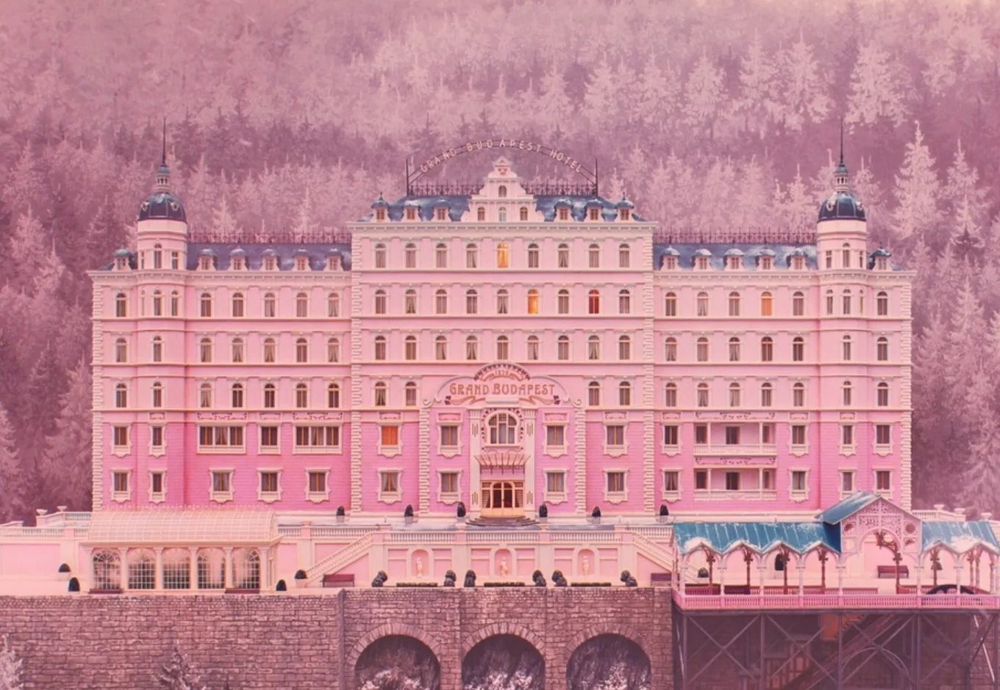
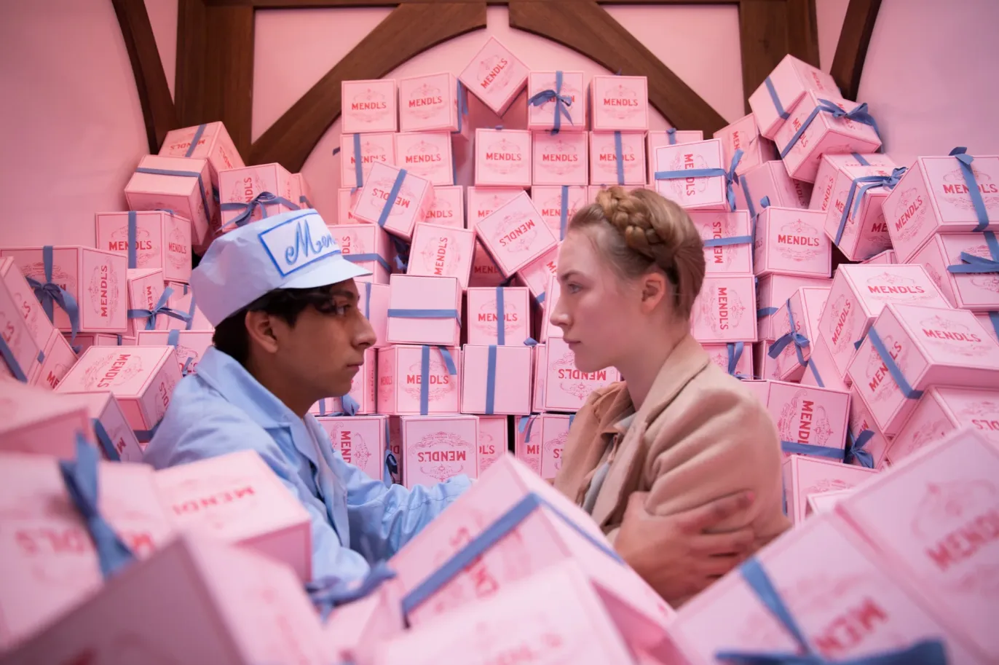
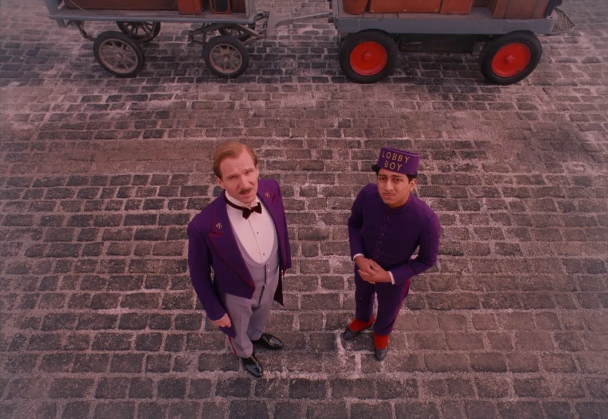

I finally watched this. And I get it now. I get why people who love art talk about this movie the way they do.

**The Grand Budapest Hotel** is a love letter. To beauty. To craft. To the idea that things can be made with such care that every single frame matters. As someone who cares about design, about intentionality, about making things *right*, this movie feels personal.

*Every frame is a painting. This isn't hyperbole—it's literally true.*

## What It's About

On the surface? A concierge named Gustave H. gets framed for murder. He and his lobby boy Zero go on this wild adventure to clear his name and steal back a painting. There's a chase, some deaths, a prison break. Standard caper stuff.

But that's not what it's really about.

It's about watching a world disappear. The Grand Budapest Hotel is this pink, perfect, impossibly elegant place that represents everything that's about to be destroyed by war. And Gustave? He's the last gentleman in a world that's stopped caring about gentlemen.

## Why It Hits Different

Wes Anderson's style usually divides people. You either love the symmetry and the pastel colors and the deadpan delivery, or you find it too precious. Too controlled.

But here? The style *is* the point.Every perfectly centered frame, every pastel color, every miniature model—it's all creating this fairy tale world that we know can't last.

The movie is told through three different time periods, each with its own color palette:
- 1930s: Vibrant pinks and purples (the glory days)
- 1960s: Warm, faded tones (the memory)
- 1980s: Cold, grey reality (what's left)

You can literally watch the color drain out as the story moves forward. It's heartbreaking.

*Anderson's signature symmetry. Every shot is composed like this—perfectly centered, perfectly balanced.*

## The Heart of It

What makes this movie work? what makes it more than just a pretty aesthetic exercise? It is the friendship between Gustave and Zero.

Gustave is this ridiculous character. He quotes poetry, seduces old ladies, obsesses over perfume. He should be a joke. But Ralph Fiennes plays him with such sincerity, such genuine care for doing things *properly*, that you can't help but love him.

And Zero? He's just a refugee kid who becomes a lobby boy. But he sees something in Gustave worth following. Worth remembering.

> "You see, there are still faint glimmers of civilization left in this barbaric slaughterhouse that was once known as humanity."

That line shouldn't work. It's so over-the-top. But in Gustave's mouth, delivered while he's literally covered in prison dirt, it's perfect. Because he *means* it. He actually believes in civilization, in manners, in doing things the right way, even when the world is falling apart.

## What Stays With You

The movie ends with Zero as an old man, alone, still running the hotel even though it's falling apart. Everyone he loved is gone. The world he knew is gone. But he keeps the hotel running anyway.

Why? Because it's all he has left of them. Of Gustave. Of Agatha. Of that brief moment when everything was perfect.

That's what gets me. The movie is about holding onto beauty even when you know it's temporary. Maybe *especially* because it's temporary.

## The Technical Stuff

If you care about how movies are made, this one is a masterclass:

**Visual Design:**
- Every frame is symmetrical
- Miniature models for exteriors (gives it that storybook feel)
- Aspect ratio changes for different time periods
- Color grading that tells the story

**The Score:**
Alexandre Desplat's music is perfect. Eastern European folk influences mixed with this playful, melancholic tone. It sounds like memory feels.

*The heart of the film. An unlikely friendship that transcends everything.*

**The Cast:**
Ralph Fiennes and Tony Revolori carry the movie, but Anderson fills every role with actors who get it. Willem Dafoe as a silent assassin. Tilda Swinton under pounds of makeup. Jeff Goldblum being Jeff Goldblum. Everyone commits completely.

## A Love Letter to Craft

This is what I mean when I talk about good design. Not design that screams for attention. Design that serves the story. Design where every choice, every color, every frame, every prop is intentional.

Wes Anderson didn't just make a movie. He built a world. And then he photographed it like every frame was a painting worth hanging on a wall.

That's what craft looks like. That's what it means to care about your work so much that you obsess over details most people won't even notice. The way a door closes. The pattern on wallpaper. The exact shade of pink.

## Why It Matters

The movie understands something true: beautiful things don't last. Elegant things get destroyed. Good people die. The world moves on.

But that doesn't make the beauty meaningless. If anything, it makes it more precious.

The Grand Budapest Hotel is a love letter to a world that never existed, mourning its loss anyway. It's silly and sad and beautiful and ridiculous all at once. And it works because Anderson commits completely. No irony. No winking at the camera. Just pure, sincere love for the craft of filmmaking.

As someone trying to make things,trying to write, trying to design, trying to create with intention, this movie feels like permission. Permission to care about details. Permission to be meticulous. Permission to make something beautiful even if it's impractical.

Maybe especially if it's impractical.

---

I'm still thinking about this movie days later. About the colors. About Gustave's ridiculous sincerity. About Zero keeping that hotel running even after everyone's gone.

About what it means to preserve beauty in a world that doesn't always care about it.

If you care about craft,about making things with intention,about making things *right*, watch this. It's a reminder that style and substance aren't opposites. That you can be meticulous and emotional. That caring about how something looks doesn't make it shallow.

Sometimes, caring about beauty is the most meaningful thing you can do.

*Watched: July 2025*
